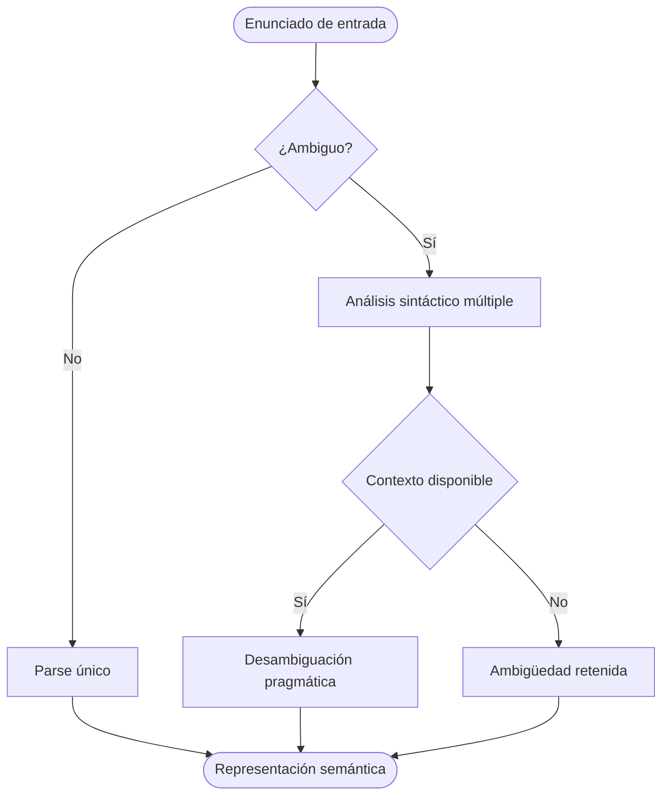

# Mermaid

> Diagramas que viven donde vive el texto

**2014 · Knut Sveidqvist · DSL de diagramas en Markdown**

## ¿Por qué?

PlantUML y Graphviz requieren instalación local y un paso de compilación separado. El diagrama vive en un archivo aparte del documento que lo referencia. Mermaid plantea que el diagrama debe poder escribirse dentro del propio Markdown, sin toolchain externo, y renderizarse donde se renderice el texto.

## ¿Qué?

Lenguaje de diagramas inspirado en Markdown, renderizable directamente en GitHub, Notion, Obsidian y cualquier plataforma que lo soporte. Unifica múltiples tipos de diagrama (flujo, secuencia, Gantt, estados…) bajo una sintaxis coherente.

## ¿Para qué?

Diagramas en documentación viva: el diagrama viaja con el documento, se versiona con él y se renderiza donde se renderice. GitHub lo adoptó de forma nativa en 2022.

## ¿Cómo?

> [LivePreview](https://mermaid.live/)

### Sintaxis

| Construcción | Significado |
|---|---|
| `flowchart LR` / `TD` | tipo y dirección del flujo |
| `A[Texto]` `B(Texto)` `C{Texto}` | formas de nodo (rect, redondo, rombo) |
| `A --> B` / `A -- texto --> B` | aristas con y sin etiqueta |
| `sequenceDiagram` | cambia a modo secuencia |
| `%%` | comentario |

### Ejemplo

````markdown

````
