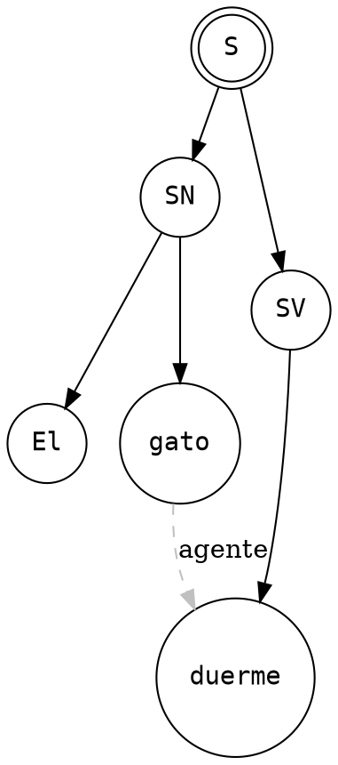

# DOT (Graphviz)

> Grafos como relaciones, no como posiciones

**1991 · AT&T Bell Labs · Lenguaje de descripción de grafos**

## ¿Por qué?

Dibujar grafos a mano es tedioso y frágil: mover un nodo obliga a redibujar todas sus aristas. El verdadero problema no es la posición de los nodos sino las relaciones entre ellos. DOT invierte la perspectiva: el usuario declara relaciones, el motor calcula el layout automáticamente mediante algoritmos de colocación de grafos.

## ¿Qué?

Lenguaje declarativo para describir grafos (dirigidos y no dirigidos). El motor Graphviz calcula automáticamente el layout: el usuario declara nodos y aristas, no coordenadas.

## ¿Para qué?

Árboles sintácticos, redes de dependencias, diagramas de flujo, visualización de estructuras de datos, mapas conceptuales. El algoritmo que usa para grafos jerárquicos (Sugiyama, 1981) es NP-completo en su forma exacta; la implementación usa heurísticas que producen layouts limpios en tiempo polinomial.

## ¿Cómo?

> [LivePreview](https://dreampuf.github.io/GraphvizOnline/)

### Sintaxis

| Construcción | Significado |
|---|---|
| `digraph G { }` | grafo dirigido |
| `graph G { }` | grafo no dirigido |
| `A -> B` / `A -- B` | arista dirigida / no dirigida |
| `A [label="texto", shape=box]` | atributos de nodo |
| `rankdir=LR` | dirección del layout |

### Ejemplo

---

*Ver también: [PlantUML](plantuml.md) · [Mermaid](mermaid.md) — alternativas de alto nivel para diagramas*
