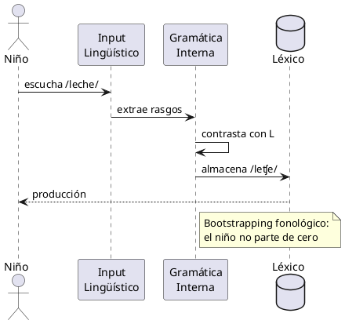

# PlantUML

> Diagramas como texto declarativo

**2009 · Arnaud Roques · DSL para diagramas**

## ¿Por qué?

Los diagramas UML se dibujaban con herramientas gráficas (Visio, ArgoUML) que producían archivos binarios: no versionables en Git, no diff-ables, no editables en un editor de texto. Cada cambio en la arquitectura implicaba abrir la herramienta, redibujar, exportar. Roques buscaba que el diagrama viviera donde vive el código.

## ¿Qué?

Lenguaje de dominio específico que genera diagramas UML (secuencia, clases, casos de uso, estados…) a partir de descripciones textuales. El motor convierte el texto en imágenes mediante Graphviz.

## ¿Para qué?

Documentación de software, arquitectura de sistemas, modelado de procesos. Los diagramas son texto plano: viven en el repositorio, se versiona su historia y se revisan en pull requests como cualquier otro fichero.

## ¿Cómo?

> [LivePreview](https://www.plantuml.com/plantuml) · [PlantText](https://www.planttext.com/)

### Sintaxis

| Construcción | Significado |
|---|---|
| `@startuml` / `@enduml` | delimitadores obligatorios |
| `Alice -> Bob : mensaje` | flecha de secuencia |
| `class Nombre { ... }` | definición de clase |
| `note left/right of` | anotaciones flotantes |
| `: texto :` | etiqueta en transición de estado |

### Ejemplo

---

*Ver también: [DOT](dot.md) · [Mermaid](mermaid.md) — alternativas · [Markdown](markdown.md) — en GitHub, Mermaid se escribe dentro de Markdown*
