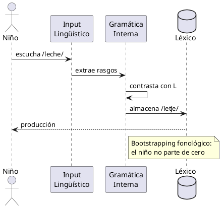
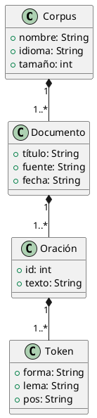
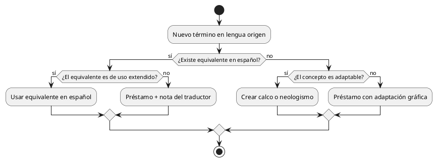
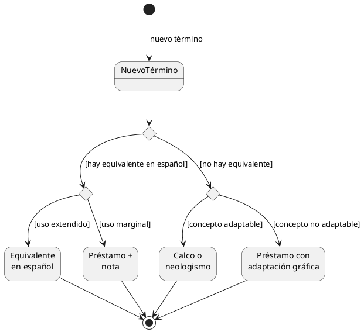
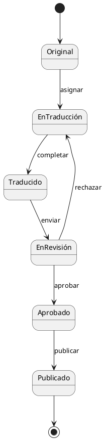

# PlantUML

> Diagramas como texto declarativo

**2009 · Arnaud Roques · DSL para diagramas**

## ¿Por qué?

Los diagramas UML se dibujaban con herramientas gráficas (Visio, ArgoUML) que producían archivos binarios: no versionables en Git, no diff-ables, no editables en un editor de texto. Cada cambio en la arquitectura implicaba abrir la herramienta, redibujar, exportar. Roques buscaba que el diagrama viviera donde vive el código.

## ¿Qué?

Lenguaje de dominio específico que genera diagramas UML (secuencia, clases, casos de uso, estados…) a partir de descripciones textuales. El motor convierte el texto en imágenes mediante Graphviz.

## ¿Para qué?

Documentación de software, arquitectura de sistemas, modelado de procesos. Los diagramas son texto plano: viven en el repositorio, se versiona su historia y se revisan en pull requests como cualquier otro fichero.

## ¿Cómo?

> [LivePreview](https://editor.plantuml.com/) · [PlantText](https://www.planttext.com/)

### Sintaxis

> Sintaxis completa en: https://plantuml.com/es/
>
> [Diagramas de estados](https://plantuml.com/es/state-diagram) / [Diagramas de flujo](https://plantuml.com/es/activity-diagram-beta) / [Mapas mentales](https://plantuml.com/es/mindmap-diagram) / [Diagramas de Gantt](https://plantuml.com/es/gantt-diagram)

| Construcción | Significado |
|---|---|
| `@startuml` / `@enduml` | delimitadores obligatorios |
| `Alice -> Bob : mensaje` | flecha de secuencia |
| `class Nombre { ... }` | definición de clase |
| `note left/right of` | anotaciones flotantes |
| `: texto :` | etiqueta en transición de estado |

### Diagrama de secuencia

### Diagrama de clases

### Diagrama de flujo

En PlantUML se llaman *diagramas de actividad*, pero son los diagramas de flujo habituales: cajas, rombos de decisión, flechas.

El mismo proceso representado como diagrama de estados, usando `<<choice>>` para las decisiones:

El diagrama de estados con `<<choice>>` contiene la misma información que el de flujo, pero sin la jerarquía anidada de `if/else`. Las decisiones son nodos más, no estructuras de control.

### Diagrama de estados

Sin decisiones, el diagrama de estados es lineal y más legible que su equivalente de flujo:

## ¿Y ahora qué?

Todos los diagramas de esta asignatura están escritos en PlantUML. El código fuente está disponible y es legible directamente:

| Diagrama | Tipo | Fuente |
|---|---|---|
| Mapa de la ingeniería lingüística | Clases | [ingenieria-linguistica-alternativo.puml](/docs/modelosUML/ingenieria-linguistica-alternativo.puml) |
| Flujo de trabajo editorial (teórico) | Estados | [day-in-the-life-teorico.puml](/docs/modelosUML/day-in-the-life-teorico.puml) |
| Flujo de trabajo editorial (real) | Estados | [day-in-the-life-real.puml](/docs/modelosUML/day-in-the-life-real.puml) |
| Taxonomía de regex (completa) | Clases | [regex-taxonomy-simple.puml](/docs/modelosUML/regex-taxonomy-simple.puml) |
| Taxonomía: literales | Clases | [regex-taxonomy-literales.puml](/modelosUML/regex-taxonomy-literales.puml) |
| Taxonomía: metacaracteres y clases | Clases | [regex-taxonomy-clases.puml](/modelosUML/regex-taxonomy-clases.puml) |
| Taxonomía: cuantificadores | Clases | [regex-taxonomy-cuantificadores.puml](/modelosUML/regex-taxonomy-cuantificadores.puml) |
| Taxonomía: anclas | Clases | [regex-taxonomy-anclas.puml](/modelosUML/regex-taxonomy-anclas.puml) |
| Taxonomía: grupos | Clases | [regex-taxonomy-grupos.puml](/modelosUML/regex-taxonomy-grupos.puml) |
| Taxonomía: lookaround | Clases | [regex-taxonomy-lookaround.puml](/modelosUML/regex-taxonomy-lookaround.puml) |
| Taxonomía: flags | Clases | [regex-taxonomy-flags.puml](/modelosUML/regex-taxonomy-flags.puml) |

---

*Ver también: [DOT](dot.md) · [Mermaid](mermaid.md) - alternativas · [Markdown](markdown.md) - en GitHub, Mermaid se escribe dentro de Markdown*
