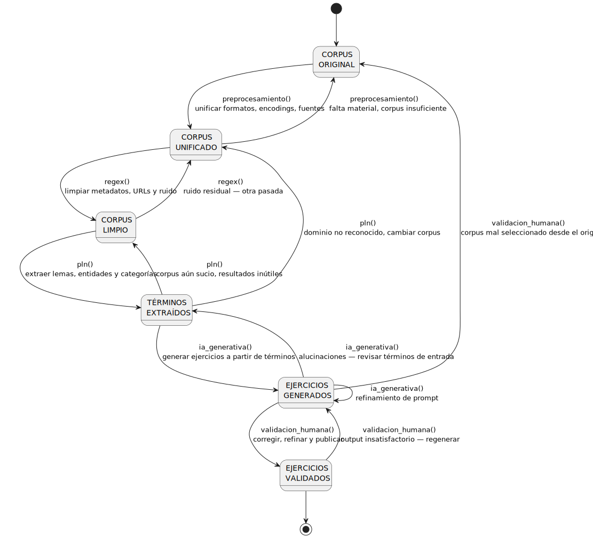

# Is this the real life?

> *Is this the real life? Is this just fantasy?*
> - Queen, Bohemian Rhapsody (1975)

El flujo teórico es limpio, ordenado y reconfortante. El flujo real tiene otra cara.

## ¿Qué cubre este curso de ese diagrama?

Cada transición del diagrama corresponde a una competencia real. La tabla siguiente indica cuáles se trabajan explícitamente en estas sesiones:

| Transición | Qué implica | ¿Se trabaja? |
| --- | --- | --- |
| `preprocesamiento()` - unificar formatos | Identificar y normalizar fuentes heterogéneas | Implícito en regex aplicado |
| `regex()` - limpiar ruido | Expresiones regulares sobre corpus real | Sí - Bloque 1 |
| `regex()` - ruido residual | Iterar y refinar patrones | Sí - Bloque 1 |
| `pln()` - extraer lemas, entidades, categorías | spaCy sobre corpus limpio | Sí - Bloque 2 |
| `pln()` - corpus aún sucio | Diagnosticar resultados de PLN | Sí - Bloque 2 |
| `ia_generativa()` - generar ejercicios | Prompting orientado a producción de contenido | Sí - Bloque 3 |
| `ia_generativa()` - refinamiento de prompt | Prompting avanzado, chain-of-thought | Sí - Bloque 3 |
| `ia_generativa()` - alucinaciones | Detectar y gestionar outputs falsos | Sí - Fundamentos IA |
| `validacion_humana()` - corregir y publicar | Criterio profesional sobre el output | Sí - Evaluación crítica |
| `validacion_humana()` - output insatisfactorio | Iterar el proceso desde generación | Sí - Evaluación crítica |
| `preprocesamiento()` - corpus insuficiente | Redefinir el corpus de partida | Pasa. Habrá que manejarlo |
| `pln()` - dominio no reconocido | Cambiar modelo o corpus | Pasa. Habrá que manejarlo |
| `validacion_humana()` - corpus mal seleccionado | Volver al origen | Pasa. Habrá que manejarlo |

Las últimas tres filas no tienen sesión asignada. No porque no sean importantes - sino porque forman parte del criterio profesional que se desarrolla con la práctica. El curso da las herramientas; la experiencia da el olfato.
